# Architecture Overview

This document provides visual diagrams of the codebase structure, focusing on the `Processor` class and its dependencies.

> **Tip:** View this in GitHub or VS Code with Mermaid Preview extension for rendered diagrams.

---

## 1. Main Entry Point: `process_request` Flow

The primary workflow when a user submits a request:


---

## 2. Detailed `process_request` Sequence

Step-by-step execution flow:


---

## 3. Processor Class - Method Map

All methods in the `Processor` class and their relationships:

```mermaid
flowchart TB
    subgraph Processor["Processor Class"]
        subgraph Core["Core Methods"]
            process_request["🎯 process_request()"]
            create_request["create_request()"]
            analyze_request["analyze_request()"]
        end
        
        subgraph RBAC["RBAC Checks"]
            check_analyze["_check_analyze_permission()"]
            check_view["_check_view_permission()"]
        end
        
        subgraph ABAC["ABAC Filters"]
            apply_abac["_apply_abac_filter()"]
        end
        
        subgraph Read["Read Operations"]
            get_request["get_request_with_results()"]
            get_recent["get_recent_results()"]
            get_high["get_high_score_results()"]
            get_by_group["get_results_by_group()"]
            get_stats["get_dashboard_stats()"]
        end
        
        subgraph Feedback["Human Feedback"]
            submit_feedback["submit_feedback()"]
            get_feedback_stats["get_feedback_stats()"]
            get_needing_review["get_results_needing_review()"]
        end
        
        subgraph RAG["RAG Methods"]
            find_similar["find_similar_cases()"]
            is_rag["is_rag_enabled()"]
        end
    end
    
    %% Core flow
    process_request --> check_analyze
    process_request --> create_request
    process_request --> analyze_request
    
    %% Analyze uses external services
    analyze_request --> check_analyze
    
    %% Read operations use ABAC
    get_recent --> check_view
    get_recent --> apply_abac
    
    get_high --> check_view
    get_high --> apply_abac
    
    get_by_group --> check_view
    
    get_request --> check_view
    
    get_stats --> get_recent
    
    %% Feedback operations
    submit_feedback --> check_view
    submit_feedback --> apply_abac
    
    get_feedback_stats --> check_view
    get_feedback_stats --> apply_abac
    
    get_needing_review --> check_view
    get_needing_review --> apply_abac
    
    %% RAG
    find_similar --> check_view
```



---

## 4. External Dependencies Map

How `Processor` connects to external modules:


---

## 5. LLM Agent Loop (Tool Calling)

How the agent iterates through tool calls:


---

## 6. File Structure

```
app/
├── models.py                    # Request, AnalysisResult (SQLModel)
├── database.py                  # Database connection
├── services/
│   ├── processor.py            # 🎯 MAIN: Processor class (business logic)
│   ├── llm_service.py          # High-level LLM interface
│   ├── validation.py           # Response quality checks
│   ├── rag_service.py          # Vector similarity search
│   ├── auth_mock.py            # RBAC/ABAC mock (→ Azure Entra ID)
│   ├── secret_manager.py       # Configuration & secrets
│   ├── llm/
│   │   ├── base.py             # BaseLLMProvider (abstract)
│   │   ├── factory.py          # Provider factory
│   │   ├── azure_provider.py   # Azure OpenAI
│   │   ├── openai_provider.py  # Standard OpenAI
│   │   ├── anthropic_provider.py # Anthropic Claude
│   │   └── ollama_provider.py  # Local Ollama
│   └── tools/
│       ├── definitions.py      # Tool schemas (OpenAI format)
│       ├── sanctions.py        # Sanctions check implementation
│       └── thresholds.py       # Amount threshold validation
└── api/
    ├── main.py                 # FastAPI routes
    └── schemas.py              # API request/response schemas
```

---

## 7. Data Flow Summary

| Step | Component | Action |
|------|-----------|--------|
| 1 | UI | User submits input text |
| 2 | Processor | `process_request()` called |
| 3 | auth_mock | RBAC permission check |
| 4 | Processor | `create_request()` - saves to DB |
| 5 | LLMService | `analyze_with_tools()` |
| 6 | LLMProvider | Agent loop with tool calls |
| 7 | tools/* | Execute sanctions/threshold checks |
| 8 | LLMProvider | Generate final JSON response |
| 9 | validation | Quality & consistency checks |
| 10 | RAGService | Generate embedding (optional) |
| 11 | Processor | Save `AnalysisResult` to DB |
| 12 | UI | Display result to user |

---

## Quick Reference: Key Methods

### Processor (processor.py)

| Method | Purpose | Permissions |
|--------|---------|-------------|
| `process_request()` | Main entry point | ANALYZE |
| `create_request()` | Persist new request | - |
| `analyze_request()` | Run LLM analysis | ANALYZE |
| `get_recent_results()` | Dashboard list | VIEW |
| `get_high_score_results()` | High-risk items | VIEW |
| `submit_feedback()` | Human feedback | VIEW |
| `find_similar_cases()` | RAG search | VIEW |

### LLMService (llm_service.py)

| Method | Purpose |
|--------|---------|
| `analyze()` | Simple LLM call (no tools) |
| `analyze_with_tools()` | Agent mode with tool loop |
| `get_model_version()` | Audit logging |

### Validation (validation.py)

| Function | Checks |
|----------|--------|
| `run_all_validations()` | Runs all checks |
| `check_response_quality()` | Min length, uncertainty |
| `check_score_consistency()` | Score range, categories |
