# **Azure GenAI Accelerator 🚀**

A production-ready template for building GenAI-powered applications on Azure. Provides a secure, scalable foundation with enterprise-grade features out of the box.

## **🏗 Architecture**

### **High-Level Design**

The system is designed with security and scalability in mind:

* **App:** Python monolith (Streamlit UI + FastAPI REST API) running in **Azure Container Apps**
* **Database:** PostgreSQL Flexible Server (stores requests and analysis results)
* **AI:** Multi-provider support (Azure OpenAI, OpenAI, Anthropic, Ollama)
* **Security:**
  * **Network:** Designed for VNET Injection & Private Endpoints
  * **Identity:** 100% Passwordless. Uses **Managed Identities** to fetch secrets from Key Vault

### **Azure Infrastructure Diagram**

```mermaid
flowchart TB
    subgraph Azure["☁️ Azure Subscription"]
        subgraph RG["📦 Resource Group"]
            subgraph VNET["🔒 VNET (10.0.0.0/16)"]
                subgraph AppSubnet["App Subnet (10.0.1.0/24)"]
                    CA["🐳 Container Apps<br/>─────────────<br/>Streamlit UI :8501<br/>FastAPI API :8000"]
                end
                subgraph DataSubnet["Data Subnet (10.0.2.0/24)"]
                    PG["🐘 PostgreSQL<br/>Flexible Server<br/>─────────────<br/>Private Endpoint"]
                end
            end
            KV["🔑 Key Vault<br/>─────────────<br/>API Keys<br/>DB Credentials"]
            AOAI["🤖 Azure OpenAI<br/>─────────────<br/>GPT-4 / GPT-4o"]
        end
    end

    User["👤 User"]

    User -->|HTTPS| CA
    CA -->|"🔐 Managed Identity<br/>(Get Secrets)"| KV
    CA -->|"🔗 Private Connection<br/>(AAD Token)"| PG
    CA -->|"🌐 API Call<br/>(Private Endpoint)"| AOAI

    style VNET fill:#e1f5fe,stroke:#01579b,stroke-width:3px
    style AppSubnet fill:#e8f5e9,stroke:#2e7d32,stroke-width:2px
    style DataSubnet fill:#fff3e0,stroke:#ef6c00,stroke-width:2px
    style KV fill:#fce4ec,stroke:#c2185b,stroke-width:2px
    style AOAI fill:#f3e5f5,stroke:#7b1fa2,stroke-width:2px
    style CA fill:#e8f5e9,stroke:#388e3c,stroke-width:2px
    style PG fill:#fff3e0,stroke:#f57c00,stroke-width:2px
```



### **Request Processing Flow**

```mermaid
sequenceDiagram
    autonumber
    participant User
    participant UI as 🖥️ Streamlit UI
    participant API as ⚡ FastAPI Backend
    participant LLM as 🤖 LLM Provider
    participant VAL as ✅ Validator
    participant DB as 🐘 PostgreSQL

    User->>UI: Enter input text
    UI->>API: POST /analyze
    
    Note over API: RBAC Check:<br/>User has ANALYZE permission?
    
    API->>DB: Create Request record
    DB-->>API: request_id
    
    API->>LLM: Analyze input (JSON mode)
    
    rect rgb(240, 248, 255)
        Note over API,LLM: 🔧 Optional: Tool/Function Calling
        LLM-->>API: Tool call request
        API->>API: Execute tool (lookup_database, etc.)
        API->>LLM: Tool result
    end
    
    LLM-->>API: {score, categories, reasoning}
    
    API->>VAL: Run validation checks
    VAL-->>API: validation_status (PASS/FAIL)
    
    API->>DB: Save AnalysisResult<br/>(with LLM trace & validation)
    DB-->>API: result_id
    
    API-->>UI: Return JSON response
    UI-->>User: Display result card<br/>(color-coded by score)
    
    Note over User,UI: 👍/👎 Human Feedback Loop
    User->>UI: Submit feedback
    UI->>API: POST /feedback
    API->>DB: Update feedback fields
```



### **Security Features**

1. **No Hardcoded Secrets:** Uses DefaultAzureCredential for automatic switching between local env vars (dev) and Managed Identity (cloud)
2. **Network Isolation:** Terraform code supports private endpoint configuration
3. **RBAC/ABAC:** Built-in role-based and attribute-based access control demo

## **✨ Key Features**

- 🔐 **Zero Trust Security** - Managed Identity, Key Vault integration
- 🤖 **Multi-LLM Support** - Azure OpenAI, OpenAI, Anthropic, Ollama
- 👤 **RBAC/ABAC Demo** - Role & attribute-based access control
- 🔍 **LLM Observability** - Full tracing for debugging
- 👍 **Human Feedback Loop** - Collect feedback for model improvement
- 🛡️ **Validation Checks** - Automated quality assessment
- 🏗️ **Infrastructure as Code** - Terraform for Azure deployment

## **🚀 Quick Start (Local)**

**Prerequisites:** Docker & Docker Compose

### 1. Clone and configure

```bash
git clone https://github.com/your-repo/azure-genai-accelerator.git
cd azure-genai-accelerator
```

### 2. Set up environment

Create a `.env` file (gitignored for security):

```env
# Required: Choose your LLM provider
LLM_PROVIDER=openai
OPENAI_API_KEY=sk-...
OPENAI_MODEL=gpt-4.1

# Or use Azure OpenAI
# LLM_PROVIDER=azure
# AZURE_OPENAI_ENDPOINT=https://...
# AZURE_OPENAI_API_KEY=...
# AZURE_OPENAI_DEPLOYMENT_NAME=gpt-4

# Or use Anthropic
# LLM_PROVIDER=anthropic
# ANTHROPIC_API_KEY=...

# Or use Ollama (free, local)
# LLM_PROVIDER=ollama
# OLLAMA_MODEL=llama3.2
```

### 3. Run with Docker Compose

```bash
docker-compose up --build
```

- **UI:** http://localhost:8501
- **API:** http://localhost:8000
- **API Docs:** http://localhost:8000/docs

## **☁️ Cloud Deployment (Azure)**

Infrastructure is defined in Terraform for reproducibility.

### 1. Provision Infrastructure

```bash
cd infra
az login
terraform init
terraform apply
```

*Creates: Resource Group, VNET, Key Vault, PostgreSQL, Container Apps*

### 2. Build and Push Images

```bash
az acr login --name <your_registry>

# Build and push UI
docker build -t <registry>.azurecr.io/genai-app:v1 .
docker push <registry>.azurecr.io/genai-app:v1

# Build and push API
docker build -f Dockerfile.api -t <registry>.azurecr.io/genai-api:v1 .
docker push <registry>.azurecr.io/genai-api:v1
```

## **🛠 Tech Stack**

| Component | Technology |
|-----------|------------|
| Language | Python 3.11+ |
| UI | Streamlit |
| API | FastAPI |
| ORM | SQLModel |
| Database | PostgreSQL |
| AI | OpenAI SDK (multi-provider) |
| Infrastructure | Terraform |
| Containers | Docker |

## **📂 Project Structure**

```
/
├── app/                      # Application Source
│   ├── main.py               # Streamlit entrypoint
│   ├── api/                  # FastAPI REST API
│   │   ├── main.py           # API entrypoint
│   │   └── schemas.py        # Pydantic schemas
│   ├── models.py             # SQLModel DB schema
│   ├── database.py           # DB connection logic
│   └── services/             # Business logic
│       ├── processor.py      # Core processing logic
│       ├── validation.py     # Quality checks
│       ├── llm_service.py    # LLM interface
│       ├── llm/              # LLM providers
│       └── auth_mock.py      # Mock identity provider
├── infra/                    # Terraform (IaC)
├── Dockerfile                # Streamlit container
├── Dockerfile.api            # FastAPI container
├── docker-compose.yml        # Local development
└── requirements.txt          # Python dependencies
```

## **🔧 Customization**

### Adding Your Business Logic

1. **Modify the system prompt** in `app/services/llm/base.py`:
   ```python
   DEFAULT_SYSTEM_PROMPT = """Your custom prompt here..."""
   ```

2. **Update the models** in `app/models.py` for your data structure

3. **Extend the processor** in `app/services/processor.py` with your logic

4. **Add tools** (optional) in `app/services/tools/definitions.py` for function calling

### LLM Provider Configuration

| Provider | Environment Variables |
|----------|----------------------|
| OpenAI | `LLM_PROVIDER=openai`, `OPENAI_API_KEY` |
| Azure OpenAI | `LLM_PROVIDER=azure`, `AZURE_OPENAI_ENDPOINT`, `AZURE_OPENAI_API_KEY` |
| Anthropic | `LLM_PROVIDER=anthropic`, `ANTHROPIC_API_KEY` |
| Ollama | `LLM_PROVIDER=ollama`, `OLLAMA_BASE_URL` |

## **📊 Observability Features**

- **LLM Tracing:** Full input/output logging for debugging
- **Validation Checks:** Automated quality assessment of responses
- **Human Feedback:** 👍/👎 buttons for collecting training data
- **Evaluation Dashboard:** Track model accuracy over time

## **🔐 Security Model**

### Roles

| Role | Can Analyze | High Score Access | All Regions |
|------|-------------|-------------------|-------------|
| Admin | ✅ | ✅ | ✅ |
| Senior Officer | ✅ | ✅ | ✅ |
| Officer | ✅ | ✅ | Own region |
| Viewer | ❌ | ❌ | Own region |

### Demo Users (Mock Identity)

Use the Identity Simulator in the sidebar to switch between:
- `admin_global` - Full access
- `senior_global` - Full access
- `officer_south` - South region only
- `officer_north` - North region only
- `viewer_south` - View only, South region

## **📝 License**

MIT License - Use freely for any purpose.
